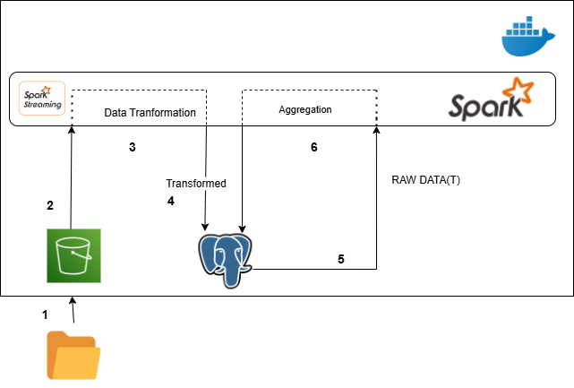

# Advanced Real-Time Data Pipeline and Analytical Processing

Designed and implemented a **scalable real-time data pipeline** that monitors a directory or S3-compatible storage for incoming data, processes it based on predefined rules, and stores the transformed data in a relational database for further analysis. The pipeline emphasizes **data integrity, performance, and scalability**.

---

## Technology Stack

- **Apache Spark 3.5** – Real-time streaming and large-scale data processing.  
- **PySpark** – Python API for Spark to perform transformations and analytics.  
- **Spark Streaming** – Continuous ingestion and processing of real-time data.  
- **PostgreSQL** – Relational database for storing transformed data and enabling querying.  
- **S3 / MinIO** – Object storage for raw and processed data.  
- **Docker** – Containerization for consistent deployment across environments.  
- **Boto3 / AWS SDK** – Integration with S3 for reading/writing data programmatically.  

---

## Architecture Overview



The end-to-end architecture follows these stages:

1. **Data Source (1)**  
   - IoT sensors or file-based data is generated and stored locally or on an S3-compatible system.

2. **Data Ingestion (2)**  
   - Spark Streaming monitors the source folder or bucket for new files and ingests them in real-time.

3. **Data Transformation (3)**  
   - Cleans, validates, and transforms incoming data using PySpark.  
   - Null checks, type validation, range validation, and metadata enrichment are performed.  

4. **Storing Transformed Data (4)**  
   - Writes processed and validated data into PostgreSQL tables for persistence and querying.  
   - Dynamic table creation based on schema and file name.

5. **Storing Raw Data (5)**  
   - Optional archival of raw or partially processed data in a data lake or warehouse (PostgreSQL/HDFS).

6. **Aggregation & Analytics (6)**  
   - Statistical aggregations per sensor or farm are calculated (min, max, avg, stddev).  
   - Results are available for dashboards, reporting, or downstream ML pipelines.

---

## Dataset

The dataset simulates real-world smart farming operations powered by **IoT sensors** and **satellite data**.  
It captures environmental and operational variables affecting crop yield across **500 farms** in regions such as **India, the USA, and Africa**.  

**Dataset link:** [Smart Farming Sensor Data for Yield Prediction](https://www.kaggle.com/datasets/atharvasoundankar/smart-farming-sensor-data-for-yield-prediction)

---

## Features

- **Real-time ingestion** of CSV/JSON files from local or cloud storage.  
- **Automatic schema validation** using JSON schema files.  
- **Dynamic transformations** including trimming, null removal, type validation, and metadata enrichment.  
- **Error handling** – invalid rows are moved to a quarantine folder with logging.  
- **Aggregation support** – calculates sensor-level statistics and stores them in aggregation tables.  
- **Scalable** – designed for deployment on distributed Spark clusters for large datasets.  
- **Dockerized** – easy setup and consistent environment for local testing and development.  

---

## Getting Started (Local Setup)

Follow these steps to run the pipeline locally using Docker, Spark, MinIO, and PostgreSQL.

### Prerequisites

- Docker (>= 20.x) – [Install Docker](https://docs.docker.com/get-docker/)  
- Docker Compose (>= 1.29.x)  
- Git (optional, for cloning the repository)  
- Python 3.9+ (for utilities and schema validation scripts)  

Verify installation:

```bash
docker --version
docker-compose --version
python --version

## Clone Repository

git clone https://github.com/Sudhanshu132/Advanced-Real-Time-Data-Pipeline-and-Analytical-Processing.git
cd Advanced-Real-Time-Data-Pipeline-and-Analytical-Processing

### Build and Start Docker Containers

# On Mac/Linux
sh start.sh

# On Windows
start.bat

## Run Upload_Schema_data file

# On Windows
data_schema_upload.bat

# On Mac Os
data_schema_upload.sh

###Author
Sudhanshu Pukale
